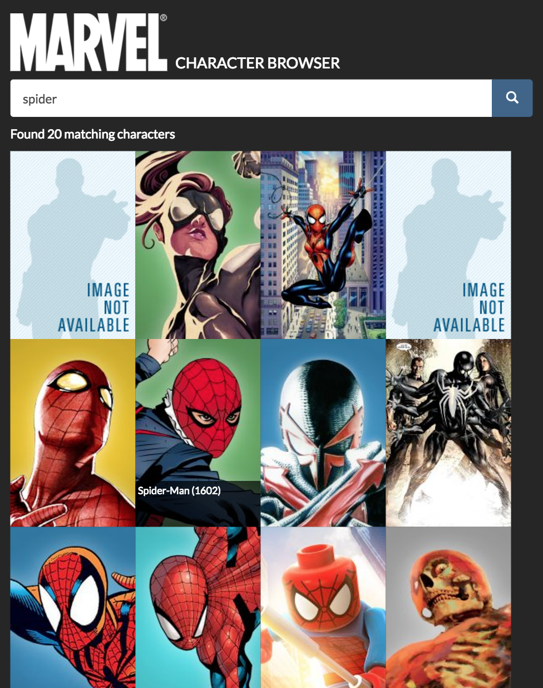

# Marvel API demo

A single-page JavaScript app to demonstrate connectivity with the Marvel API, built using React and Redux. The application is based on the [create-react-app](https://github.com/facebookincubator/create-react-app) starter kit.

[View the live demo](https://marvel.elkdanger.co.uk)

## Prerequisites

- NodeJS >= 4.x
- [yarn](https://yarnpkg.com/en/) or npm
- An API key for [the Marvel API](https://developer.marvel.com)

## Getting started

Clone this repository and run `$ yarn install` (or `$ npm install`) from the command line to install dependencies.

## Running the app

Your public API key for the Marvel API must be supplied as an environment variable `REACT_APP_API_KEY` for the application to work.

To start the application on port 3000, run:

`$ REACT_APP_API_KEY=<api key> yarn start`

or if using npm: 

`$ REACT_APP_API_KEY=<api key> npm start`

where `<api key>` is your public API key for the Marvel API.

## Testing the app

To run all the associated unit tests using [Jest](https://facebook.github.io/jest/docs/tutorial-react.html), run `$ yarn test` (or `$ npm test`).

## Browser support

The application has been tested on:

- Chrome 59
- Internet Explorer 11
- Microsoft Edge 38
- Firefox 52
- Brave Mobile (Android)

## Preview

